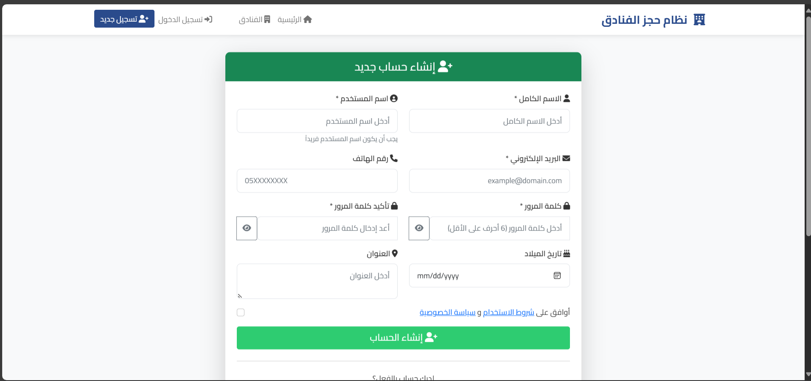
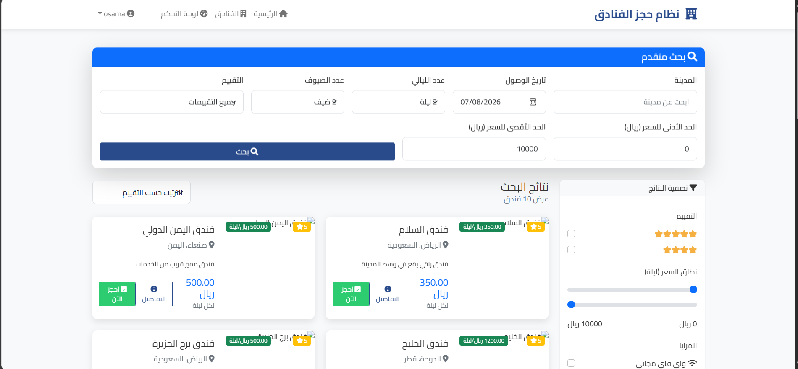
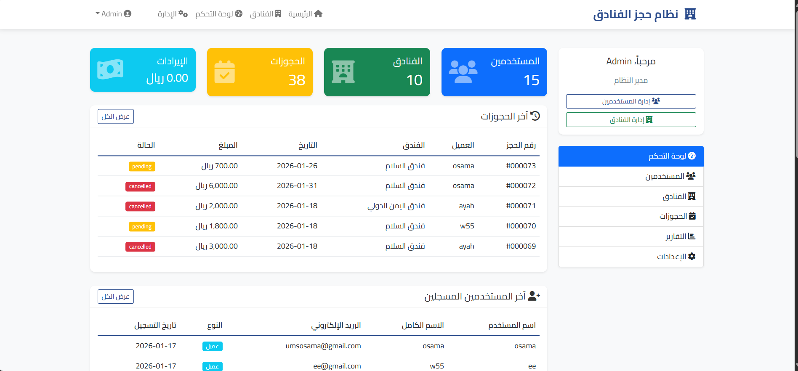

# Hotel Booking System

A complete hotel booking and reservation management system built with PHP and MySQL. The system allows users to browse hotels, make reservations, manage bookings, and provides an administrative dashboard for managing the platform.

## Features

- User registration and login
- Hotel browsing and search
- Room reservation system
- Booking management
- User profile management
- Admin dashboard
- Database-driven application
- Responsive web interface

## Technologies Used

- PHP
- MySQL
- HTML5
- CSS3
- JavaScript

## Project Structure

```text
hotel-booking-system/
├── admin/
├── api/
├── auth/
├── config/
├── css/
├── database/
│   └── hotel_booking.sql
├── includes/
├── js/
├── pages/
├── screenshots/
│   ├── admin-dashboard.png
│   ├── booking.png
│   ├── home.png
│   └── login.png
├── user/
├── index.php
├── config.php
├── logout.php
├── LICENSE
├── .gitignore
└── README.md
```

## Installation

1. Clone the repository:

```bash
git clone https://github.com/shehab552/php-hotel-booking-system.git
```

2. Move the project to your web server directory.

3. Create a MySQL database.

4. Import the SQL file:

```text
database/hotel_booking.sql
```

5. Configure database credentials in:

```text
config.php
```

6. Start Apache and MySQL.

7. Open the project in your browser.

## Screenshots

### Home Page


### Login Page



### Booking Page



### Admin Dashboard



## Future Improvements

- Online payment integration
- Email notifications
- Hotel rating and reviews
- Multi-language support
- Advanced search filters

## License

This project is licensed under the MIT License.